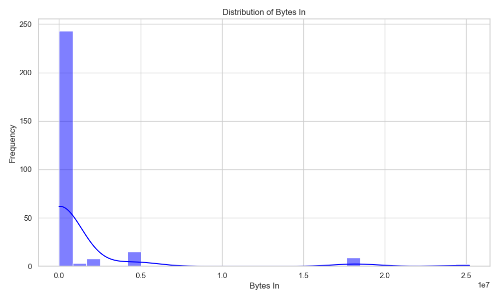
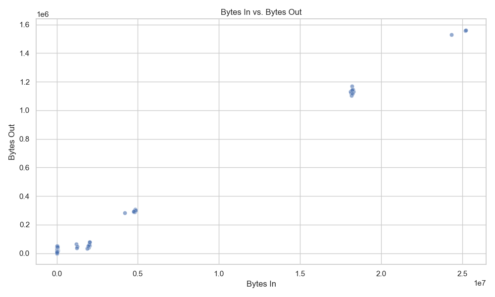
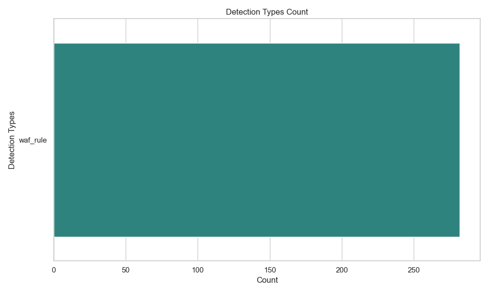

# Cybersecurity Web Traffic Analysis
A project analyzing suspicious web traffic to detect anomalies and showcase data analysis and cybersecurity skills.

## Project Overview
This project analyzes a dataset of suspicious web traffic collected through AWS CloudWatch to identify anomalies, trends, and potential security threats. The goal is to showcase data analysis and visualization skills in the context of cybersecurity.

## Project Structure
- **`data/`**: Contains raw and cleaned datasets.
  - `CloudWatch_Traffic_Web_Attack.csv`: Raw dataset.
  - `CloudWatch_Traffic_Web_Attack_Cleaned.csv`: Cleaned dataset after preprocessing.
- **`images/`**: Stores visualizations and charts.
  - `bytes_in_distribution.png`: Histogram showing the distribution of `bytes_in`.
  - `bytes_in_vs_bytes_out.png`: Scatter plot showing the relationship between `bytes_in` and `bytes_out`.
  - `detection_types_count.png`: Bar plot displaying counts of detection types.
- **`scripts/`**: Python scripts for preprocessing, analysis, and anomaly detection.
  - `data_preprocessing.py`: Cleans and prepares the dataset for analysis.
  - `analysis.py`: Analyzes data and generates visualizations.
  - `anomaly_detection.py`: (Upcoming) Detects anomalies in web traffic.
- **`requirements.txt`**: Lists dependencies for the project.

## How to Run
1. **Install Required Libraries**:

2. **Run the Scripts**:
- Preprocess the data:
  ```
  python scripts/data_preprocessing.py
  ```
- Perform analysis:
  ```
  python scripts/analysis.py
  ```
- Detect anomalies (Upcoming):
  ```
  python scripts/anomaly_detection.py
  ```

## Dataset
The dataset includes:
- **`bytes_in`**: Bytes received by the server.
- **`bytes_out`**: Bytes sent from the server.
- **`src_ip`**: Source IP address.
- **`detection_types`**: Type of detection applied.
- **Additional Metadata**: Information such as `protocol`, `timestamps`, and `country code`.

## Goals
- **Detect Anomalies**: Identify unusual patterns in web traffic.
- **Visualize Trends**: Highlight suspicious activity through data visualizations.
- **Classify Traffic**: Differentiate between normal and suspicious traffic.

## Results
Findings and visualizations are stored in the **`images/`** folder, including:
- Distribution of `bytes_in`.
- Relationship between `bytes_in` and `bytes_out`.
- Count of detection types.

## Next Steps
- Implement anomaly detection in `anomaly_detection.py`.
- Enhance visualizations with interactivity.
- Conduct further classification of suspicious traffic using machine learning techniques.

## About
This project demonstrates practical data analysis and cybersecurity skills, integrating Python, Pandas, and Matplotlib/Seaborn to extract insights from suspicious web traffic data.





